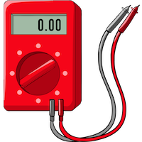

<p align="center">
    <a href="#connected">
        
    </a>
</p>

# Connected

[![][build-img]][build]
[![][nuget-img]][nuget]

Issues tests commands to SMTP, RDBMS and Redis servers.

[build]:     https://ci.appveyor.com/project/TallesL/net-connected
[build-img]: https://ci.appveyor.com/api/projects/status/github/tallesl/net-connected?svg=true
[nuget]:     https://www.nuget.org/packages/Connected
[nuget-img]: https://badge.fury.io/nu/Connected.svg

## SMTP

Issues a [`HELO`] to a SMTP server and checks the [reply code] for a `200` (non standard), `220` or `250`.

```cs
using ConnectedLibrary;

if (Connected.Smtp("example.org", 25))
{
   // Ready to go
}
```

[`HELO`]:     https://tools.ietf.org/html/rfc5321#section-3.2
[reply code]: https://tools.ietf.org/html/rfc5321#section-4.2.3

## RDBMS

Issue a `SELECT 1` to a SMTP server and checks if it went OK.

```cs
using ConnectedLibrary;

if (Connected.Rdbms("Data Source=.\SQLEXPRESS;Initial Catalog=MyDatabase;Integrated Security=true"))
{
   // Ready to go
}
```

## Redis

Issue a [`PING`] to a Redis server and checks if it went OK.

```cs
using ConnectedLibrary;

if (Connected.Redis("example.org", 6379))
{
   // Ready to go
}
```

[`PING`]: http://redis.io/commands/ping
